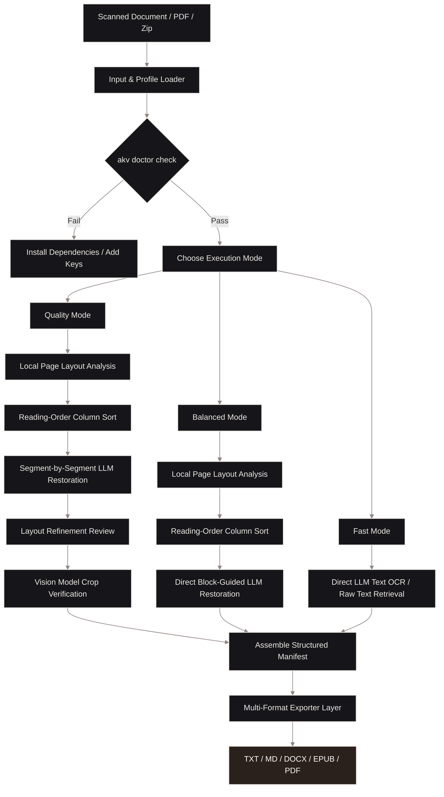

# Akshara Vision

<pre style="color: #e65c00; background-color: #16161a; font-family: monospace; font-weight: bold; line-height: 1.2; padding: 1.5rem; border: 1px solid #c45a00; border-radius: 6px; overflow-x: auto;">
                     _    _  __ ____  _   _    _    ____      _
                    / \  | |/ // ___|| | | |  / \  |  _ \    / \
                   / _ \ | ' / \___ \| |_| | / _ \ | |_) |  / _ \
                  / ___ \| . \  ___) |  _  |/ ___ \|  _ &lt;  / ___ \
                 /_/   \_\_|\_\|____/|_| |_/_/   \_\_| \_\/_/   \_\
                                              V I S I O N
                               Restore. Read. Preserve.
</pre>


Akshara Vision is a local-first, layout-aware document intelligence engine designed to restore, OCR, translate, and export scanned books, historical manuscripts, and complex multi-column documents.

It provides a keyboard-first terminal interface, reusable profiles, hybrid model routing, and publication-style document exporters.


---

## 1. Hybrid Restoration Workflow

Akshara Vision uses a hybrid architecture that combines fast local layout segmenters with the linguistic power of language models:



### Detailed Pipeline Flow:
1. **Dependency Diagnostics**: `akv doctor` checks for local binaries (Tesseract, Poppler, LibreOffice, headless Chromium) and cloud keys to ensure runtime capability.
2. **Local Page Segmentation**: Detects page structure (columns, coordinates) using heuristics or local ML layout backends.
3. **Reading-Order Sorting**: Reconstructs page columns to prevent text column mixing.
4. **Hybrid Model Routing**: Routes extraction blocks to local LLMs (Ollama, LM Studio, llama.cpp) or cloud APIs (Gemini, OpenAI, Anthropic).
5. **Block-Guided LLM Restoration**: Restores damaged text segment-by-segment using block-guided vision prompts (`[BLOCK x]`).
6. **Verification & Crops**: Vision model filters figure crops to reject bleed-through or blank space, and tables are validated into CSV rows.
7. **Exporters Layer**: Compiles final output files (Markdown, DOCX, EPUB, searchable PDF) in publication quality.

---

## 2. Execution Modes

Select an execution mode based on your priority for speed, cost, and complexity:

| Execution Mode | Pipeline Steps Included | Target Use Case & Tradeoff |
| :--- | :--- | :--- |
| **Quality** | Local segmentation + Reading-order sort + Block-guided LLM restoration + Layout refinement review + Vision crop verification. | **Best results**: Maximizes layout reconstruction for damaged pages and historical manuscripts at the expense of higher API token cost and processing time. |
| **Balanced** (Default) | Local segmentation + Reading-order sort + Direct block-guided LLM restoration. | **Optimal compromise**: Delivers high layout and text accuracy while skipping costly iterative LLM-based layout reviews. |
| **Fast** | Direct LLM text extraction / Heuristic OCR. | **Maximum speed**: Bypasses block-mapping coordinate arrays, segment prompting, role classification, and figure cropping for immediate raw text extraction. |

---

## 3. Quick Start

### Installation

1. **Clone and install**:
   ```bash
   git clone https://github.com/BGRaaj/akshara-vision.git
   cd akshara-vision
   python3 -m venv .venv
   source .venv/bin/activate
   
   # For basic restoration:
   pip install -e .
   
   # OR for layout-boosted ML parsing (highly recommended for multi-column pages):
   pip install -e ".[layout]"
   ```

   > **Note for Windows Users**: If you encounter a `WinError 206 (filename too long)` error during installation of ML layout modules, please refer to the **[Windows Troubleshooting Guide](docs/onboarding.md#windows-troubleshooting)** to enable long path support.

2. **Verify environment and dependencies**:
   ```bash
   akv doctor
   ```

### Basic Usage

To run the interactive guided setup to configure your default model and profile:
```bash
akshara
```

To run a fast document extraction using your active profile:
```bash
akv q path/to/document.pdf
```

To inspect run comparisons side-by-side in your browser:
```bash
akv compare akshara-output/run-folder-name
```

---

## 4. Documentation Directory

For deep dives into specific subsystems and configurations, refer to the centralized **[index.md](index.md)** documentation hub:

* **[Onboarding & Setup](docs/onboarding.md)**: Standard settings, terminal UI guidelines, and profile locks.
* **[Supported Models & API Keys](docs/models.md)**: Configuration guides for Ollama, LM Studio, llama.cpp, Gemini, OpenAI, and Anthropic.
* **[Profiles Configuration](docs/profiles.md)**: Writing portable TOML profiles to manage languages, export formats, and execution defaults.
* **[Document Intelligence](docs/document-intelligence.md)**: Bounding boxes, layout trees, reading order, and page segment classifications.
* **[Workflows & CLI Design](docs/workflows.md)**: Deeper look at batch processing, resumable staged runs, and visual reviews.
* **[Grounded Document Chat](docs/chat.md)**: Guide to query processed runs and audit segment citations.
* **[Inputs and Exporters](docs/inputs-outputs.md)**: Detailed mapping of supported formats (Markdown, HTML, DOCX, EPUB, PDF).
* **[Privacy & Security](docs/privacy.md)**: Metadata handling, cache isolation, and key management.

---

## Contributing

We welcome bug reports, feature suggestions, and general feedback. Please open a thread on the [GitHub Issue Tracker](https://github.com/BGRaaj/akshara-vision/issues). To maintain project focus, external code pull requests are not accepted at this time.

## License

Akshara Vision is open source software licensed under the **AGPL-3.0** license. If you host, modify, or use this engine in a commercial service or product, you must open-source your entire application code under the same license. For commercial licensing inquiries, please open a GitHub issue.
